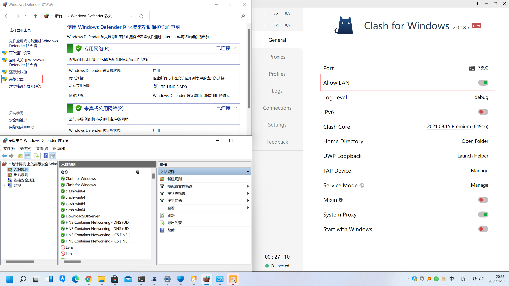

# wsl proxy


## set proxy
```shell
./scripts/wsl-proxy.sh

alias proxy="source /path/to/proxy.sh"
. /path/to/proxy.sh set

source ./wsl-proxy.sh set
source ./wsl-proxy.sh unset
./wsl-proxy.sh test
```


